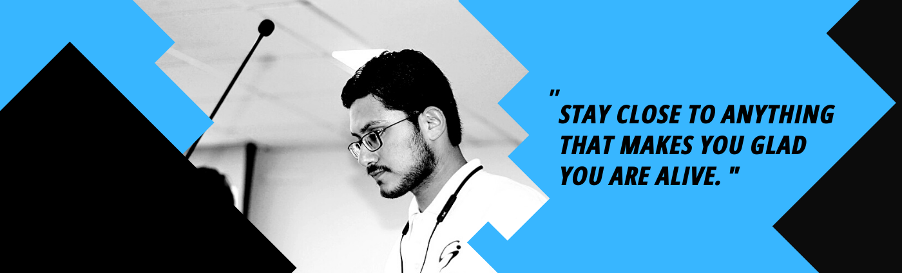

<h1 align="center">Hey there, I'm Rishabh 👋</h1>
<h3 align="center">A passionate Backend Developer, Competitive programmer and ML enthusiast !</h3>

 
<h3>⚫ Lets Connect 🤝</h3><

 
<h3>⚫ I help geeks by writing articles over here 🤓</h3><a href="https://auth.geeksforgeeks.org/user/rishabhtyagi2306/articles">
  
 
<h3>⚫ Have a look at my work 👇</h3>
 
<h3>⚫ Have a look at my coding profiles 👇</h3>

 
 

<h2> ✔️ Tools and Techs Used by me ;)</h2>

 
 
 
 
 

<a href="https://github.com/rishabhtyagi2306">
 
 
 
 

  
